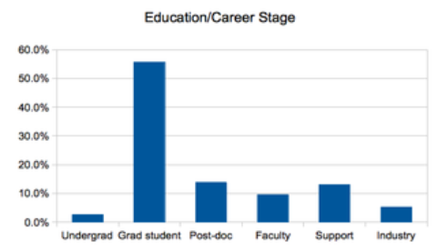
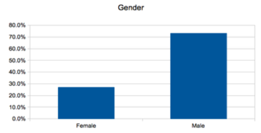

% Software Carpentry - Overview
  INSTAAR
% Aron Ahmadia and Chris Kees
% January 2015

## Copy This Lecture!
  
  
  
  
  
  
 Software Carpentry Overview by <a xmlns:cc="http://creativecommons.org/ns#" href="http://software-carpentry.net" property="cc:attributionName" rel="cc:attributionURL">Software Carpentry</a> is licensed under a <a rel="license" href="http://creativecommons.org/licenses/by/3.0/deed.en_US">Creative Commons Attribution 3.0 Unported License</a>.

# More About Software Carpentry

## History

* Founded by Greg Wilson in 1998, teaching scientists how to use supercomputers at LANL.
* Open sourced materials 2004-present
* Currently funded by the Sloan Foundation and the Mozilla Foundation

## What We Teach

* Unix Command Line Interface (Shell)
* Shell automation 
* Version Control
* Python
* Testing
* Some nice python modules (numpy, pandas) 

## What We *Actually* Teach

* A program is just another piece of lab equipment
* Programming is a human activity
* Little pieces loosely joined
* Let the computer repeat it
* Paranoia makes us productive
* Better algorithms beat better hardware

*How to THINK like a programmer*

## Who We Teach

<table>
<tr>
<td></td>
<td></td>
</tr>
<tr>
<td></td>
<td></td>
</tr>
</table>

## Who We Are

* Aron Ahmadia (ERDC)
* Chris Kees (ERDC)
 
## Our Goals for You

### We will take you on a tour of:

* Automating things with the **Shell**
* Managing and sharing Software, Data, and Manuscripts with **Git**
* Practical Programming with **Python**
* Scientific Computing with Python (numpy, matplotlib)
* Data munging / parsing with Python
* Geospatial data processing and visualization with community tools

# Some High-Level Advice

## Introduction

There are a plethora of best practices
available to help you scientifically compute.
It is likely that you will only be able to afford a limited amount of
time learning a subset of them.
The purpose of this lecture is to help orient you on the path to writing software as part of your research by: 

>
* introducing the most important practices of software construction
    + and relating them to your role as a mathematician
* making specific recommendations for 
    + selecting tools that you should be using 
    + and practices that you should be following

## The 8 Essential Practices

>
1. Write Programs for People, Not Computers
2. Let the Computer Do the Work
3. Make Incremental Changes
4. Don't Repeat Yourself (or Others)
5. Plan for Mistakes
6. Design Flexibly for Performance, Build Accessibly for Correctness
7. Document Design and Purpose, Not Mechanics
8. Collaborate

# 1. Write Programs For People, Not Computers

## 1. Write Programs For People, Not Computers

>
* **[a]** A program should not require its readers to hold more than a handful of facts in memory at once.
* **[b]** Make names consistent, distinctive, and meaningful.
* **[c]** Make code style and formatting consistent.

# 2. Let the Computer Do the Work

## 2. Let the Computer Do the Work

>
*  **[a]** Make the computer repeat tasks.
*  **[b]** Save recent commands in a file for re-use.
*  **[c]** Use a build tool to automate workflows.  

# 3. Make Incremental Changes.

## 3. Make Incremental Changes.

>
*  **[a]** Work in small steps with frequent feedback and course correction.
*  **[b]** Use a version control system.
*  **[c]** Put everything that has been created manually in version control.

## Organize with Wikis

>
*  **[a]** organize your personal notes into a personal wiki (gollum, gitit, instiki)
*  **[b]** organize your shared notes into a group wiki (gollum, gitit, instiki)

## Use Version Control for Checkpointing and Collaboration

>
* use local version control software to checkpoint personal code development
  + checkpointing your work encourages wild ideas and late-night coding sessions
  + you can easily restore back in the morning if it was a bad idea
* use **distributed version control** to collaborate with others
* I advocate *Git*, but you may be stuck with whatever your group uses
  + though check out git-svn for using Git to collaborate with an svn repository, it's awesome!

# 4. Don't Repeat Yourself (or Others)

## 4. Don't Repeat Yourself (or Others)

>
*  **[a]** Every piece of data must have a single authoritative representation in the system.
*  **[b]** Modularize code rather than copying and pasting.
*  **[c]** Re-use code instead of rewriting it.

## Automate common actions by saving simple blocks of code into **scripts**

>
* A script is a set of commands organized into a single file
* Sometimes it takes a few arguments, but more often there are just some parameters at the top of the file to modify
* The script is the basest unit of scientific programming, you should be comfortable writing these whenever you want to save or otherwise document or repeat your actions
* Use scripts to explore new ideas, they are easy to write and throw away
* **Don't repeat commands into your REPL, save them to a script**

## Refactor commonly used blocks of code into **functions**
>
* Eventually, you will find that your scripts have a lot of repeated code, or that you are spending a lot of time adjusting parameters at the top of the file
* Refactor out repeated code into **function calls** in your scripts and implement the **function** either in the same file or a separate one
* Be comfortable with the calling and return syntax of your programming language environment, whether it is BASH or Python
* **Don't repeat code in scripts, refactor them to functions**

## Group commonly used functions into **libraries**

>
* If you are unlucky enough to have to write a lot of software functions for your work, you might want to consider designing and releasing a library so that others do not have to share your misfortune
* You might want to first check that nobody else has implemented the functionality you need
* If something close exists, it may be worth adapting to your needs if the project is of high quality and suitably licensed
* *Openly licensed non-commercial libraries tend to have a much longer effective lifespan than unreleased codes*
* **Share your code with others, and use their code**

# 5. Plan for Mistakes

## 5. Plan for Mistakes

>
*  **[a]** Add assertions to programs to check their operation.
*  **[b]** Use an off-the-shelf unit testing library.
*  **[c]** Turn bugs into test cases.
* **[d]** Use a symbolic debugger.

## Verify and Validate your Code

>
* **verification** - is your code correctly written?
* **validation** - do your computations accurately model the physical phenomena in question?
* test frameworks help you verify your code, but validation is usually a manual process
 + although it is desirable to write regression tests that verify previously validated results hold true when the code has been modified!
* use the **method of manufactured solutions** to verify correctness of code
* use **comparisons to experiment** to validate code
* use **comparisons to similar software** as an additional check

# 6. Document design and purpose, not mechanics.

## 6. Document design and purpose, not mechanics.

>
*  **[a]** Document interfaces and reasons, not implementations.
*  **[b]** Refactor code in preference to explaining how it works.
*  **[c]** Embed the documentation for a piece of software in that software.

## Principles of documentation

>
* Save every bit of code you use for generating publishable results
* Document and comment your code for yourself as if you will need to understand it in 6 months
  + use README files liberally
  + as well as file-level, function-level, and inline documentation
* If any piece of code is too complex to easily describe, consider refactoring it

# 7. Design flexibly for performance, build accessibly for correctness

## 7. Design flexibly for performance, build accessibly for correctness

>
*  **[a]** Better algorithms beat better architectures
*  **[b]** Write code in the highest-level language possible.
*  **[c]** Use a profiler to identify bottlenecks.

## Be fluent in multiple languages
You speak multiple languages when interacting with a computer.  Choosing to use a new tool, library, or language can be similar to learning a new language:

>
+ There is a high initial startup cost as you learn vocabulary, grammar, and idioms  
`sum(x*y for x,y in itertools.izip(x_vector, y_vector))`
+ You will learn faster by observing and working with others who are more skilled than you
+ But once you have gained some fluency, you will find yourself capable of new things!

## Use domain specific languages and libraries to increase your expressivity

* Aim for languages and tools that allow you to express your models simply.
* Minimize the coupling to external libraries so it is easier to upgrade, replace, or remove them.

## Use REPL Environments for Development

**REPL (read-eval-print-loop)** environments tighten the coupling between the code you write and the results you see, increasing productivity.

|REPL                          |              non-REPL |
:----------------|:----------------------|
| IPython and Python    |                   C/C++ |
| Julia                            |                  Fortran  |
| Interactive Sessions   |                      Batch Systems |

# Collaborate

## Collaborate

>
* Use pre-merge code reviews.
* Use pair programming when bringing someone new up to speed and when
tackling particularly tricky problems.
* Use an issue tracking tool.

## Reduce Complexity

>
* Endeavor to use languages and libraries that reduce the complexity of your work
* It is worth installing a complicated or expensive software tool if your computations are naturally expressed with it
* Always look for opportunities to write **less** code
    + you will have to do less initial work (sometimes)
    + you will introduce less bugs
    + your code will be easier to understand and maintain
* When writing software, try to keep individual functions short, single-purpose, and avoid excessive nesting

## Aim for reproducibility
* The goals of non-review scientific publications are to:
    + Describe a new result or approach
    + Convince others of its usefulness
* The **reproducibility** of your publication will greatly benefit both of these goals

## Schedule

# Closing Thoughts

## You sometimes need geeks.  You never need dorks.

<table>
<tr>
<td></td>
</tr>
</table>

# References and Further Reading

# Research Literature

## Programming Languages for Scientific Computing
Matthew G. Knepley

Preprint: http://arxiv.org/pdf/1209.1711.pdf

*Gives an overview of modern programming languages and techniques such as code
generation, templates, and mixed-language designs. This is a preprint,
so expect some rough spots.*

## Two Solitudes
Greg Wilson

Slides: http://www.slideshare.net/gvwilson/two-solitudes

*Describes Greg's journey as a scientist and leader for the Software Carpentry
project, provides some insight into the differences between industry and
academics.*

## Best Practices for Scientific Computing
D. A. Aruliah, C. Titus Brown, Neil P. Chue Hong, Matt Davis, Richard T. Guy,
Steven H. D. Haddock, Katy Huff, Ian Mitchell, Mark Plumbley, Ben Waugh,
Ethan P. White, Greg Wilson, Paul Wilson

Preprint: http://arxiv.org/abs/1210.0530

*Good summary paper of many fundamental practices for working with and
developing scientific software. This is a preprint, so expect some rough spots.*

# Web References

## What Every Computer Scientist Should Know About Floating-Point Arithmetic
David Golberg

Web article: http://docs.oracle.com/cd/E19957-01/806-3568/ncg_goldberg.html

*Introduction to the IEEE floating-point standard, its implications, and many of
the common pitfalls when using floating-point numbers in scientific computing*

## Science Code Manifesto

http://sciencecodemanifesto.org

*Publicly signed commitment to clear licensing and curation of software
associated with research publications.*

